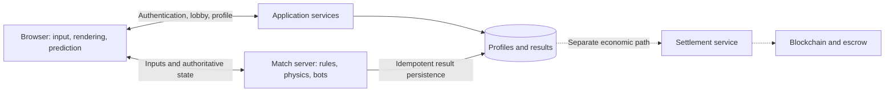

# Historical Design Review — 2026-09-20

**Archived, non-normative.** This is the pre-ADR working draft, preserved for source assessment, citations, and legacy decision IDs D01–D40. It includes proposals and implementation-status statements that were accurate before the first laboratory. Do not update it as the current specification. Use the [project map](../game-design-and-architecture.md), [ADRs](../adr/README.md), and current specifications instead.

---

# Project Soccer — Game Design and Architecture

Version 0.9 · 2026-09-20 · **Working draft with confirmed product decisions; implementation has not started**

## 1. Overall assessment

A browser-based multiplayer football game, including a future match with 22 human participants, is technically plausible. This does not establish the achievable quality, operating cost, or delivery date. Gameplay, target devices, and real network conditions must be tested.

The hardest problem is not displaying 22 footballers or broadcasting their positions. It is making player intention, ball contact, animation, and server decisions agree despite network delay. Goalkeepers, computer-controlled teammates, and animation production are also substantial work.

### Confirmed direction

- A 3D football game with believable actions, starting on a smaller pitch and eventually supporting 11 human players per side.
- In human 1v1, each participant controls a team and switches between its footballers.
- In human 11v11, each participant controls one assigned footballer.
- NFTs, blockchain, and real-money matches are central to the product, but their development can be separated from gameplay development.
- Development is carried out by the founder alone with Codex. No additional development team is assumed.
- Server requirements will be measured before choosing hosting, capacity, and expenditure. Weekly availability and budgets for assets or specialist services remain unspecified, rather than assumed to be zero.
- The game is named **Project Soccer**, and the founder identifies [project-soccer](https://github.com/project-soccer) as its GitHub organization. The founder approved three repositories: `game`, `website`, and `contracts`, each with its own local directory. Client, server, shared core, and canonical documentation are together in `game`; the local migration is complete. The repositories are public to encourage community participation; licensing remains undecided.
- For the first prototype, the founder selected **accessible but credible gameplay**, with responsive input, moderate assistance, and readable errors.
- The founder selected an **elevated oblique sideline camera that follows the action**. Fixed yaw, framing, zoom limits, and exact projection remain implementation proposals.
- The desktop browser prototype is **gamepad-first, with keyboard support**. Exact bindings and device/browser coverage remain to be validated.
- The first complete prototype match uses **two humans, each controlling three outfield footballers plus one AI goalkeeper**, with an initial **40 × 26 m pitch and four-minute matches**. Dimensions and duration are tunable after playtests.
- The initial action set is **ground pass, charged shot, sprint, standing tackle, and footballer switching**, with simplified out-of-bounds restarts. Offside, sliding tackles, and player-commanded aerial actions are deferred for this prototype.
- **All project documentation must be written in English.** This applies to design documents, repository READMEs, contribution guides, architecture decisions, issue templates, and release notes.

### Recommendations awaiting acceptance

Stylized graphics, detailed action/restart behavior beyond the accepted basic rules, and the proposed authoritative technical stack. Avoiding purchasable competitive advantages is a recommendation, not an approved business requirement.

The founder explicitly deferred the relationship between NFT price, rarity, and playing strength until the business model is developed. Neither purchasable advantages nor normalized competitive attributes have been approved as the final model.

Matching the content breadth and animation quality of EA Sports FC is not a realistic initial scope for a small project. Using selected aspects as references—directional shooting, control, and readable actions—is useful. The specific qualities that matter must be identified.

### Reading this document

- **Evidence:** a finding from the supplied documents or cited primary documentation.
- **Recommendation:** a proposed project choice, subject to acceptance or revision.
- **Open:** a product decision, resource constraint, or technical experiment still required.
- Performance numbers are proposed test targets, not measured results.

The current work covers analysis, documentation, published repository scaffolds, and prototype definition. Instructions inside the supplied LLM documents to build software or deploy contracts are source material, not authorization to execute those steps. No gameplay implementation or deployment has started.

## 2. Source documents and conflicting proposals

The founder supplied three documents:

| Source filename | Main contribution |
|---|---|
| `architettura_gioco_calcio.md` | 3D architecture, authoritative simulation, WebRTC, up to 22 participants, physics and animation questions |
| `pjsc_1.md` | Extended PitchChain proposal: 2D arcade gameplay, crypto economy, Solidity examples, roadmap, and commercial targets |
| `pjsc_2.md` | Shorter PitchChain proposal with many unresolved choices |

These filenames identify private input material; the originals are not included in the prospective public repositories. Their numbering does not establish an approved chronological sequence. The original LLM conversations were not supplied, so statements described as confirmed by those models are not automatically founder decisions. PitchChain is the historical working name used in the inputs; the founder has now named the game Project Soccer. Domains, repositories, and social accounts claimed in the inputs have not been verified as project-owned resources.

| Topic | Conflicting proposals | Assessment |
|---|---|---|
| Product | Short 2D arcade matches versus elaborate 3D football | The founder has now selected 3D |
| Format | 1v1/2v2 versus up to 11v11 | Distinguish human participants from simulated footballers |
| Control | Individual footballer versus team switching | Both are now required in different modes |
| Graphics | Phaser, PlayCanvas, Three.js | Alternatives, not a cumulative stack |
| Networking | Colyseus/WebSocket versus Geckos/WebRTC | Compare using the same gameplay and network scenarios |
| Trust | Authoritative server plus supposedly trustless winnings | The contract relies on a server-reported result |
| Fairness | No pay-to-win, but rarer NFTs have stronger attributes | An unresolved business and competitive-design conflict |
| Gas | Solved, negligible cost, no waiting | Funding and transaction flows are incomplete; stake validity must precede kickoff |
| Security | Audit before launch, but also audit after mainnet release | Financial exposure must follow verification and audit |
| Timeline and market | Rapid MVP, thousands of users, market uniqueness | Unsupported assumptions, not delivery or commercial commitments |

The strongest common choice is authoritative simulation. The least reliable area is the economy presented as solved, particularly the financial code described as complete.

## 3. Principal technical corrections

### 3.1 Authority does not prohibit client simulation

The server decides valid movement, possession, contacts, goals, and match results. The browser may run shared logic to predict local movement or a shot immediately. Those calculations are provisional and cannot authorize outcomes. Sharing simulation code is compatible with server authority; relying on secrets embedded in the browser is not.

Server authority prevents many speed, teleportation, and fabricated-result cheats. It does not eliminate automated clients that submit legal inputs, collusion, multiple accounts, or arranged matches. Input validation is necessary but insufficient for all abuse cases.

### 3.2 2D is possible; 3D does not require full physical realism

Bicycle kicks can be represented with sprites or prerendered animation. The advantages of 3D are aerial play, multiple directions, camera flexibility, and reusable animations. A 3D game can still constrain most footballer movement to the pitch plane and use simplified contact rules.

### 3.3 WebRTC is an option, not a universal requirement

WebSocket provides reliable, ordered delivery; packet loss can delay subsequent data. WebRTC DataChannels support ordering and retransmission settings. They are not automatically unreliable and do not remove congestion or distance-related latency. [MDN: RTCDataChannel](https://developer.mozilla.org/en-US/docs/Web/API/RTCDataChannel).

Geckos introduces deployment considerations around native components, UDP, signaling, and ICE/STUN/TURN configuration. Test it on the actual infrastructure and user networks. WebRTC can be used in a client-server topology. [Geckos documentation](https://github.com/geckosio/geckos.io).

Colyseus supplies room management and property-change synchronization, with network updates separate from simulation frequency. Its tools still need game-specific integration for prediction and reconciliation. The current documentation also lists WebTransport: frameworks and transports should not be treated as interchangeable categories. [Colyseus state synchronization](https://docs.colyseus.io/state), [available transports](https://docs.colyseus.io/server/transport).

Colyseus describes its WebTransport implementation as experimental. It is not the proposed initial production transport. Browser compatibility, fallback behavior, and channel semantics require explicit testing. [Colyseus WebTransport](https://docs.colyseus.io/server/transport/webtransport).

### 3.4 Determinism does not require an immediate fixed-point implementation

With one authoritative server, every browser need not simulate an identical world indefinitely. Predictable movement, correction, and sufficient reproducibility for diagnosis are the initial requirements.

A fixed timestep alone does not guarantee determinism. Engine versions, initialization, operation order, randomness, and external mathematics matter. Rapier documents cross-platform determinism for its JavaScript/WASM version under matching conditions, while noting that external operations such as some trigonometric functions can invalidate those conditions. This makes it a candidate, not a guarantee for the complete game. [Rapier determinism](https://rapier.rs/docs/user_guides/templates/determinism).

### 3.5 Outdated technology choices

Node.js 20 reached end of life on April 30, 2026. Node.js 24 LTS is the proposed baseline, subject to dependency compatibility checks when implementation starts. [Official Node.js release schedule](https://github.com/nodejs/Release).

Remove the proposed migration to Polygon zkEVM Mainnet Beta. Polygon announced the sequencer sunset for July 1, 2026. This announcement concerns zkEVM, not Polygon PoS. It is sufficient to reject zkEVM as the planned destination of a new project; no operational network test was performed here. [Polygon announcement](https://forum.polygon.technology/t/polygon-zkevm-mainnet-beta-sunset-claim-your-funds/21856).

Choose supported, compatible, pinned versions of React, PostgreSQL, Solidity, and other dependencies at implementation time, rather than copying versions from older documents.

## 4. Proposed game design

### 4.1 Initial scope

| Area | Proposal | Status |
|---|---|---|
| Audience | Accessible, competitive browser football | Mainstream versus crypto-native positioning remains open |
| Platform | Desktop browser prototype, gamepad-first with keyboard support | Confirmed priority; exact device/browser matrix open |
| Presentation | Elevated oblique sideline camera following the action; stylized 3D proposed | Camera direction confirmed; art style and camera tuning open |
| Feel | Accessible but credible, responsive input, moderate assistance, readable errors | Direction confirmed; inertia and trajectories require playtesting |
| Control | Team switching in human 1v1; assigned footballer in human 11v11 | Confirmed |
| First complete match | Three outfield players and one AI goalkeeper per side | Confirmed: four footballers per team |
| Initial participants | Two humans, one per team; AI controls unselected footballers and goalkeepers | Confirmed for the first complete prototype match |
| Duration | Four minutes; draws allowed in friendlies proposed | Initial duration confirmed and tunable; ending details proposed |
| Rules | Simplified restarts, standing tackles; no offside, sliding tackles, or commanded aerial actions | Basic scope confirmed; detailed restart/contact policies proposed |
| Progression | Appearance, personal records, rankings; fair competitive attributes | Recommendation; NFT strength model deliberately unresolved |
| Economy | NFTs, blockchain, real-money matches; separate development path | Confirmed; initial gameplay validation without real stakes proposed |

Before a complete match, build the action laboratory in section 4.7, including early animation and two-browser tests. This measures input response, passing, and contested possession; it is not the full product.

Always distinguish “human 1v1 with four footballers per side” from “11 humans per side.” The first is the confirmed initial format; the second is the confirmed long-term direction.

### 4.2 Two control modes, one simulation

Representing both modes early has modest data-model overhead. Good teammate AI, footballer switching, and team play still require substantial implementation and testing.

Each on-field footballer has an identity, a team, and a current controller: an authorized human or a bot. Control is separate from NFT ownership and usage rights. Match mode determines who may control which footballer.

In human 1v1, the server applies a switch atomically: validate the request, assign the new footballer, and return the previous one to AI. No footballer accepts human and AI commands simultaneously. Switching preserves movement, stamina, and action state; it cannot cancel tackle recovery or an ongoing shot.

Inputs carry a control-assignment identifier so delayed commands for the previous footballer cannot affect the newly selected one. The browser may predict selection and its indicator, but reconciles with the authoritative assignment.

In human 11v11, roles are assigned before kickoff and free switching is disabled. Substitutions require explicit rules. Human goalkeeping, role selection, reconnection, and absence handling need mode-specific design. A temporary bot during disconnection, followed by controlled handback, is proposed.

The model can accommodate intermediate modes, but additional 2v2, 5v5, or mixed queues are not automatically in scope: they fragment both development and matchmaking. Automatic selection after passing and defensive switching details remain open. The initial 1v1 prototype uses an AI-only goalkeeper; possible later manual goalkeeping is a separate decision.

A separate economic question is whether 11v11 participants bring their own NFTs or control footballers assigned from a club-owned squad. Preserve the distinction between ownership, usage rights, and control without building a lending system before it is needed.

### 4.3 Proposed controls and action semantics

**Feel, input priority, and basic action set confirmed; bindings and detailed action behavior remain proposals.** The founder selected accessible but credible play: quick input response, moderate assistance, and understandable errors. Bounded acceleration and turning are proposed ways to support that feel. Gamepad-first with keyboard support is the confirmed testing priority. Controls are remappable; the names below describe standard Xbox-style positions rather than an exclusive controller requirement.

| Intent | Gamepad proposal | Keyboard proposal | Initial behavior |
|---|---|---|---|
| Move and aim | Left stick | WASD | Direction relative to the camera's ground-plane axes; normalize keyboard diagonals |
| Sprint | Hold right trigger | Hold Shift | Higher speed, wider turns and longer touches; release returns to normal running |
| Ground pass | South button / A | J | Tap toward a teammate; initial assisted power based on distance, within a cap |
| Shoot | Hold/release east button / B | Hold/release K | Hold charges power to a cap; release commits the attempt |
| Standing tackle | West button / X | L | Timed attempt within reach, followed by recovery; holding does not repeat it |
| Change footballer | Left bumper | Q | Select an eligible outfield teammate; goalkeeper excluded initially |

Movement direction supplies the initial aiming direction; at neutral input use the last valid facing. Pass targeting uses a directional cone, distance, and a stable candidate indicator. Assistance may adjust an initial direction toward a plausible receiver, but must not home the ball onto the receiver after release or suppress an interception. With no eligible teammate, pass into the aimed space. Shot assistance should be modest; aiming away from the goal must not silently become a goal-directed shot.

Charging, wind-up, contact, and recovery are distinct. Before committing a kick, a short charge may be cancelled with the switch command; this must not change the active footballer while a committed kick is pending. At release, lock the intended direction and cap additional body rotation. The server evaluates whether the ball is still reachable at contact. A lost ball produces a missed attempt rather than teleportation. Exact timings and the assistance cone are tuning variables, not fixed promises. First-time passes, volleys, manual shot height, and skill-move combinations are deferred.

Proposed handoff: after a committed pass actually contacts the ball, transfer human control to the selected receiver; a manual switch may override it after that handoff. If there is no recipient, retain the passer. In defense, manual switching favors a reachable defender near the ball; ties use stable ordering. Receiving an interception with an AI teammate may trigger selection of the new ball carrier. All automatic switches must be visible, server-authorized, and cancellable by subsequent manual selection. Switching never clears action recovery or creates a second controller.

Gamepad and keyboard use the same legal action model and assistance settings during comparison. Gamepad connection/mapping, dead zones, loss of window focus, and device disconnection require explicit handling. A disconnected input device sends neutral input and cancels an uncommitted charge; it must never leave sprint or charging stuck. Browser gamepad support is available but actual devices must be tested. [MDN Gamepad API](https://developer.mozilla.org/en-US/docs/Web/API/Gamepad_API/Using_the_Gamepad_API).

### 4.4 Proposed footballer and ball interaction

A completely free physical ball can turn football into a collision game; a ball rigidly attached to a foot can make possession artificial. Use a hybrid candidate and validate it in the action laboratory:

| Situation | Proposed rule | Visible consequence |
|---|---|---|
| Free ball | Dynamic sphere, gravity, ground friction, bounce, and continuous collision checks as needed | Passes can be intercepted and shots can rebound |
| Receiving | Reach, facing, relative speed, and available action time determine whether a bounded first touch is possible | A fast or poorly aligned pass may rebound or run past the receiver |
| Controlled dribble | Discrete guided touches with limited reach and impulse, not a rigid attachment or arbitrary position reset | The ball remains a short distance ahead and can be challenged between touches |
| Sprinting with the ball | Longer touches and reduced sharp-turn capability | More speed trades against close control |
| Pass or shot | One authorized impulse at the scheduled contact time, with direction, power, and height limits | The foot and ball visibly meet; the ball then follows a free trajectory |
| Standing tackle | Check reach, approach angle, action phase, and cooldown | A well-timed attempt pokes the ball loose; possession is not guaranteed |
| Goalkeeper save | Finite reaction, movement, contact volume, and catch/parry limits | Reachable shots may be caught or parried; shots outside reach remain goals |

A possession label grants eligibility for controlled touches, not immunity from opponents. Leaving the reachable region breaks control. Simultaneous claims are resolved on one authoritative tick using geometric and timing criteria, with a stable final tie-break; packet arrival order must not directly award possession. Test whether any tie-break creates systematic team bias.

Body collisions should prevent overlapping footballers and excessive pushing. Do not let kinematic player capsules become unlimited-force bulldozers that launch the ball: deliberate touches and tackles need their own bounded action rules, while incidental body deflections require calibrated limits. No full skeletal collision simulation is proposed.

For the first experiment, use identical outfield movement and technical attributes, no hidden random accuracy, no weak-foot penalty, and no match-long stamina model. Sprint is initially balanced by turning and ball-control costs. A later stamina experiment is possible if sprint dominates. Goalkeepers have a distinct role and legal catch rules, but equal configurations across teams. These are experimental controls, not a decision about NFT strength or final competitive balance.

Ground passing and shooting must be useful before adding lofted passes, curve control, headers, slides, volleys, or bicycle kicks. The ball remains fully 3D, so vertical rebounds and moderately elevated shots are still supported. Initial shot height follows a bounded power-to-launch-angle curve; a separate loft control is deferred.

### 4.5 Proposed first complete match rules

**Format, initial pitch size, duration, and basic rule scope are confirmed; detailed policies below remain proposals.** The format is human 1v1 controlling **three outfield footballers plus one AI goalkeeper per team**. This provides two passing options and defensive cover with less animation/AI scope than larger squads. A later format change would require a new decision based on playtesting.

| Rule | Initial proposal |
|---|---|
| Pitch | 40 × 26 meters, flat, with touchlines and no rebound walls |
| Goals | 4 × 2 meters; dimensions are configurable, not an official competition claim |
| Ball | Approximately 0.11 m collision radius; evaluate a visual outline/shadow for readability without changing its collision size |
| Match time | One four-minute period; no halftime; draws allowed; timer runs during ordinary restarts |
| Kickoff | One center pass; conceding team restarts after a goal; deterministic restart positions |
| Sideline exit | Ground kick-in to the opposite of the last-touch team |
| Goal-line exit | Corner after defender's last touch; goalkeeper restart after attacker's last touch |
| Restarts | Server sets ball and nearby positions, enforces opponent clearance, allows a ground pass, and takes a deterministic automatic pass after five seconds |
| Goalkeeping | AI only; catch/parry within its area; automatic ground distribution within three seconds |
| Goalkeeper area | Provisional centered rectangle 10 m wide and 6 m deep; configure and visualize it consistently |
| Fouls | No full referee, cards, penalties, offside, or sliding tackles in this prototype; standing challenges and collision rules must prevent repeated body abuse |
| Back-pass | Simplified goalkeeper handling allowed initially; official back-pass rules deferred and clearly disclosed |
| Interruption | Short disconnect cancels the experimental match with a clear message; it does not produce ranked or financial results |
| Completion | One result screen and a mutual rematch option; private room/join link, no public ranked queue |

A goal requires the **whole ball** to cross the goal line between the posts and below the crossbar. Use swept crossing checks, not only an instantaneous center trigger. Resolve the authoritative order of crossings, posts, and contacts and emit one goal event. At time expiry, the final processed simulation tick decides whether a crossing counts; no indefinite final attack. Goal animation may finish after the result is fixed.

Restarts, last-touch attribution, timer behavior, clearance distance, and restart selection need executable rules before the complete-match milestone. The proposed early disconnect cancellation is a test-session policy, not the eventual abandonment/refund policy for competitive or staked play.

### 4.6 Proposed camera, players, and visual direction

The founder selected an elevated sideline camera, looking obliquely onto the pitch and following the action. The remaining details are proposals: keep yaw fixed during play so camera-relative directions remain stable. Start with a perspective view and a restrained field of view; test framing before adopting an orthographic alternative. Follow a smoothed target combining the ball and controlled footballer, with limited lead in the direction of play. Avoid large automatic zoom changes, camera shake, and rotations on a player switch.

The ball, controlled footballer, and likely pass recipients should remain readable at the selected desktop resolution. Clamp the camera near boundaries and favor showing the goal during attacks. Brief off-screen indicators may be needed; a tactical radar is not initially necessary on a small pitch. Future individual-control 11v11 will require its own off-ball framing tests; the same view is not assumed to work without changes.

Start with one stylized humanoid body and shared skeleton, realistic-enough proportions to show foot contact, two strongly distinguishable fictional kits, visible numbers, and a controlled-player marker. Avoid relying on red/green color alone. Goalkeepers have a distinct kit. No faces, separate body types, player marketplace, skill progression, or named club licenses are needed for the experiment.

A shared model does not mean all footballers perform the same tactical role. In the three-outfield format, bots maintain support, width, and cover. In possession there should be a nearby outlet and a forward option; in defense one pressures while others cover. Roles can change as the ball moves. Bots use the same legal actions, bounded reaction time, and non-perfect information about future trajectories; they must not instantly know a human's next command.

### 4.7 Prototype sequence and review gates

This proposal separates the first technical deliverable from the first complete match. It is not a schedule or authorization to implement unaccepted product choices.

| Milestone | Included | Review gate |
|---|---|---|
| B1 — Action laboratory | One controlled footballer, ball, target receiver, simple pitch, movement, sprint, dribble, receive, pass and shoot; first rigged animations | Observable foot/ball contact; no ball attachment artifacts; movement and direction changes feel usable |
| B2 — Networked duel | Two browsers, one human per side, a teammate target, standing tackle, server authority, switching, prediction/correction | Compare the same interactions locally and at controlled delay; no duplicate contact or double control; measure corrections |
| C — Complete small match | Eight simulated footballers, two humans, support/defense AI, goalkeeper animations, score/timer, restarts and rematch | Ten consecutive scripted sessions finish without manual repair; playtest reports assess control, readable possession, useful passing, and enjoyment separately |

Use human feedback as well as functional checks: a match completing is not evidence that it is enjoyable. Log the command, accepted action, contact tick, ball transition, correction magnitude, and build/configuration versions for failures. Initial target profiles remain those in sections 7–8 and 11; performance and latency are unmeasured.

Before implementation, settle detailed rules, switching policy, asset approach, and the proposed stack. Format, initial dimensions/duration, AI goalkeeper, feel, camera direction, and primary input have been confirmed. Numerical tuning can stay experimental. Select actual reference hardware and available controllers for measurement; do not infer them from the development computer alone.

## 5. Architecture and repository organization

Rendering must not be a dependency of simulation. Financial services must not block the match loop. Valid funding is a precondition for starting a staked match and is checked before kickoff.

### 5.1 Proposed stack

| Component | Proposal | Rationale and conditions |
|---|---|---|
| Language | Strict TypeScript | Share types and movement; still validate incoming data at runtime |
| 3D renderer | PlayCanvas Engine, standalone local workflow | Proposed code-first setup in Git; editor not required; validate one rig and action sequence before committing to a large asset pipeline |
| 3D alternative | Babylon.js | Consider if its local development workflow is a better fit |
| Three.js | Targeted alternative | Capable rendering and animation, with more game systems to integrate |
| 2D | Phaser excluded from current scope | 3D is confirmed; a 2D prototype would not make migration free |
| Physics | Rapier 3D WASM, subject to testing | Dynamic ball, kinematic footballers, continuous collision detection where needed |
| Server | Node.js 24 LTS | Isolate match work from databases and external services |
| Initial rooms and transport | Colyseus with WebSocket | Reduce room and connection work; keep simulation independent |
| Alternative transport | Geckos/WebRTC after measured comparison | Adopt only if benefits justify operational complexity |
| UI and build | Vite, TypeScript, pnpm workspace; simple HTML/CSS prototype HUD | React may be added for menus/profiles later; no need to introduce it for a timer and score |
| Persistence | In-memory rooms for the experiment; PostgreSQL later | Durable accounts, matches, and rankings only when needed; no database operations in the simulation tick |
| Redis | Add when distributed coordination is needed | Not required for the first experimental room |
| Assets | Versioned files and object storage/CDN | IPFS is an optional NFT metadata concern, not a game-download requirement |
| Source organization | Three repositories: game, website, contracts | Client/server share core source in the game workspace; separate build and runtime boundaries |

PlayCanvas provides state-based animation and can be used without its editor. Editor use is a workflow and cost decision, not a requirement to host everything with one provider. [PlayCanvas animation](https://developer.playcanvas.com/user-manual/animation/), [standalone engine](https://developer.playcanvas.com/user-manual/engine/standalone/).

Babylon.js offers WebGL/WebGPU and animation capabilities. The provisional PlayCanvas preference is a design judgment, not a benchmark result. [Babylon.js specifications](https://www.babylonjs.com/specifications/). Three.js also supports character animation; the issue is the surrounding systems that must be built. [AnimationMixer](https://threejs.org/docs/pages/AnimationMixer.html).

PlayCanvas uses Ammo for integrated physics. Choosing Rapier requires an explicit simulation-to-rendering integration and disabling Ammo simulation for the same objects. Do not let two engines decide the same collision. If integrated editor physics becomes the priority, evaluate Ammo on both sides as an alternative. [PlayCanvas physics](https://developer.playcanvas.com/user-manual/physics/).

#### Engine comparison requested by the founder

The founder asked to compare the recommendation with “PahseJS” (interpreted here as Phaser; correct this if another library was intended) and Three.js. The stack has **not** been approved. Renderer/engine selection is separate from choosing Rapier for simulation or Colyseus for networking.

| Candidate | Evidence and useful capabilities | Project-specific assessment |
|---|---|---|
| PlayCanvas | Browser game engine with entity/component structure and animation state graphs; standalone local development supported | Preferred first experiment for a small animated football game; its animation organization may reduce integration work, but football behavior and network correction still need custom code |
| Babylon.js | 3D engine with skeletal animation, retargeting, inspection tools, and physics integration options | Strong alternative, especially if asset debugging/retargeting works better with our actual rig; no measured basis for calling it slower or worse |
| Three.js | 3D library with skeletal animation playback, blending/cross-fades, scene graph, and loaders | Technically suitable; attractive when prioritizing a custom rendering architecture, but we would own more of the game/component lifecycle and animation-state orchestration |
| Phaser | A 2D framework without built-in 3D rendering or physics | Exclude for the confirmed 3D game; third-party 3D additions introduce a second integration layer without a demonstrated benefit here |

Primary documentation: [PlayCanvas animation](https://developer.playcanvas.com/user-manual/animation/), [standalone workflow](https://developer.playcanvas.com/user-manual/engine/standalone/), [Babylon.js capabilities](https://www.babylonjs.com/specifications/), [Three.js animation actions](https://threejs.org/docs/pages/AnimationAction.html), [Phaser scope](https://docs.phaser.io/phaser/getting-started/what-is-phaser).

The PlayCanvas preference is a judgment about scope and maintenance for this project, not proof of better graphics, lower latency, or 22-player performance. Three.js is not disqualified by animation quality; its animation APIs support blending. The distinction is how much surrounding game infrastructure we choose to maintain. All three 3D candidates still require assets, football-specific AI, action/contact logic, authoritative networking, and testing.

Using PlayCanvas without its editor reduces the editor's workflow advantage, and using Rapier instead of integrated Ammo means physics integration remains our responsibility. Babylon.js also has integrated physics options, but retaining the proposed shared Rapier core would require an explicit adapter there too. These costs must be included in the comparison. Replacing the renderer is not a solution to poor ball-control rules or incorrect networking.

Recommend trying PlayCanvas with the single rig/pass/shot/network slice below, keeping simulation independent. Reconsider Babylon.js if concrete asset/animation tooling problems emerge. Prefer Three.js if the founder explicitly values a custom engine layer enough to accept its additional ownership. Do not implement three parallel prototypes or claim that later engine replacement would be free.

#### First prototype stack recommendation

Use TypeScript across the game workspace, PlayCanvas for rendering/animation, Rapier for simulation, and Node.js 24 LTS plus Colyseus/WebSocket for an authoritative room. This is a recommendation requiring a compatibility experiment, not a benchmark result or a claim that the integration already exists. Node.js currently lists 24 as LTS. [Node.js releases](https://nodejs.org/en/about/previous-releases).

PlayCanvas documents a standalone Vite/TypeScript workflow, so game source and build steps can stay in Git without a mandatory hosted editor. Rapier's character controller is a starting point for movement/collision handling; acceleration, turning, tackles, and footballer separation remain game-specific work. [PlayCanvas standalone setup](https://developer.playcanvas.com/user-manual/engine/standalone/), [Rapier character controller](https://rapier.rs/docs/user_guides/javascript/character_controller/).

The technical gate is one asset-to-game slice: load a rigged model and clips; drive it from shared movement/action state; simulate a ball on the server; play the same kick at its authoritative contact phase; and reproduce the interaction in two browsers. If that fails because the animation tooling is unsuitable, evaluate Babylon.js with this same slice. Do not maintain parallel engines. If ball/contact behavior fails, changing the renderer alone will not solve it.

Use one authoritative simulation state and explicit adapters to Colyseus state and client presentation. Do not use network state containers as a replacement for prediction history or treat framework synchronization as automatic rollback. Begin with one local server and private rooms; add a small remote test deployment only when authorized and needed for real-network evidence. No database, Redis, wallet integration, Kubernetes, or paid infrastructure purchase is required for the first action laboratory.

Pin compatible package versions when implementation starts, commit the workspace lockfile, and document actual setup commands then. Package versions and animation assets have not yet been installed or tested together.

### 5.2 Approved repository boundaries

The founder approved the three-repository layout on 2026-09-20. The local directories have been migrated. The parent is a coordination workspace outside the three repositories. On 2026-09-20 the founder authorized publishing the planning scaffold and explicitly selected public visibility. The three GitHub repositories have been created; each local repository uses `main` and an SSH origin. Organization access and SSH authentication have been verified. Licensing remains undecided.

| Repository | Local contents | Responsibility |
|---|---|---|
| `project-soccer/game` | `game/client/`, `game/server/`, `game/packages/game-core/`, `game/docs/` | Browser game, authoritative matches/application services, shared simulation/protocol, canonical design |
| `project-soccer/website` | `website/` | Public website, community entry point, canonical brand assets |
| `project-soccer/contracts` | `contracts/` | NFT/escrow contracts, financial tests, versioned interfaces, future deployment tooling |

Within `game`, keep these module boundaries:

- `client/`: input, graphics, audio, camera, presentation, prediction. Never authoritative for goals, movement validity, or payouts.
- `server/`: match hosting, bots, room authorization, application APIs, persistence, and settlement integration. Operational secrets remain outside source control.
- `packages/game-core/`: shared simulation, movement/action rules, protocol schemas, and compatibility fixtures. No DOM, renderer, database, wallet signing, or secrets.
- `docs/`: the single canonical cross-project design, decisions, roadmap, and contribution guidance, all in English.

Shared simulation and protocol may use separate entry points so consumers do not load unnecessary physics code. Client and server use declared workspace dependencies; publishing shared packages to a registry is not initially required. Generated contract ABIs should come from versioned contract artifacts rather than manually copied files.

The website may link to or host the built game without duplicating game source, account services, or wallet services. A shared game repository does not require a single process or deployment. Keep separate client/server build targets and prevent server-only dependencies from entering the browser bundle.

Use ordinary sibling checkouts when Git repositories are created. Git submodules, a parent Git repository, custom repository orchestration, and a separate infrastructure repository are not required.

### 5.3 Keeping builds and repositories compatible

Client, server, and shared core can change together in one game commit. Deployed clients and servers can still differ, so source co-location does not remove compatibility requirements:

- Use declared workspace dependencies and a committed lockfile once the build toolchain is selected. A clean game checkout must build and run client/server without sibling website/contracts checkouts or unpublished local files.
- The connection handshake identifies the protocol and simulation/rules version. Reject unsupported combinations with a clear update message instead of allowing silent divergence.
- A breaking protocol change requires a coordinated release or an explicit compatibility window. Document rollout order before deploying it.
- Game checks cover affected modules and a focused client/server compatibility scenario. Website and contracts maintain their own appropriate checks.
- Pin any consumed contract-artifact version and verify its interface compatibility. Gameplay prototyping must run without blockchain services.
- Record the source commit, dependency lock, client/server build identifiers, protocol/rules versions, and any contract-artifact versions tested together. Introduce automation when implementation begins.
- Match logs record the versions needed to reproduce a result.

GitHub repositories have been created with explicit founder authorization. Package publication and automation credentials remain later actions; no package registry has been selected.

### 5.4 Open-source preparation

The founder selected public repositories to support community participation. Software and asset licenses still need to be chosen; public visibility does not establish a licensed open-source release or evidence of contributors or funding.

Before opening licensed code and asset contributions, decide the software license, asset redistribution terms, treatment of trademarks, contribution process, and private security-reporting channel. A public repository alone does not establish an open-source license. [GitHub guidance on repository licensing](https://docs.github.com/en/repositories/managing-your-repositorys-settings-and-features/customizing-your-repository/licensing-a-repository). Do not assume that licenses for purchased models, music, or animations permit redistribution of their source files. Plan a redistributable placeholder asset set so contributors can run the game without private commercial assets.

Publishing the simulation is compatible with an authoritative server. Validate inputs and keep signing keys, credentials, personal information, and production data outside repositories. Code availability does not make the operator's match result trustless or make financial deployment audited.

For a solo maintainer, start with a short setup guide, one reproducible demo, a prioritized roadmap, and clearly bounded contribution tasks. Contributions are reviewed by the founder; future community growth must not be counted as delivery capacity today. Documentation should distinguish implemented behavior, proposals, and known limitations.

### 5.5 Runtime state boundaries

The server keeps the authoritative world in memory. The client stores received authoritative state separately from predicted and interpolated presentation. Profiles and results are persistent; matchmaking queues may be temporary. The economic path has separate contracts and services, initially exercised on a test network. The first gameplay prototype must run without those services.

### 5.6 Rationale for keeping game components together

**Status: approved on 2026-09-20; local directory migration complete.** Separate repositories are useful when components have independent teams, access requirements, release schedules, or consumers. For one maintainer building a tightly coupled multiplayer game, the initial six-repository split added coordination costs before those benefits were demonstrated. The founder accepted a combined `game` repository, with `website` and `contracts` separate as listed in section 5.2.

Benefits for this project: coordinated protocol changes, no mandatory shared-package publication during early development, reproducible local setup, and a single contribution that includes simulation, rendering, and server checks. Costs: a larger checkout, build/test selection to maintain, and fewer repository-level access boundaries. Revisit extraction if independent teams or external consumers appear.

A repository's source can be public or private independently of whether it is a monorepo. Open-source community participation does not require separate client and server repositories. A working demo, understandable architecture, setup instructions, and bounded tasks matter more than repository count.

#### Where AGENTS.md belongs

Codex discovers project instructions from the project root, usually the Git root, down to the working directory. More specific instructions take precedence. Therefore, do not rely on a file outside a repository to supply its shared instructions. [Official OpenAI documentation](https://learn.chatgpt.com/docs/agent-configuration/agents-md).

The parent `AGENTS.md` remains a local coordination file outside the child repositories. Root instruction files now exist at `game/AGENTS.md`, `website/AGENTS.md`, and `contracts/AGENTS.md`; each is included in its owning Git repository. Add specialized files under game modules only when needed. Each repository must carry its own applicable shared rules rather than relying on the parent file.

Keep operational agent instructions concise: language policy, module boundaries, relevant commands once available, and required checks. Link to the full design document rather than copying it. Personal preferences belong in personal configuration; shared project expectations belong in version control. An organization-level `.github` repository can host community material, but should not be assumed to provide automatic cross-repository agent-instruction inheritance.

## 6. Physics, animation, and bots

### 6.1 Football rules above the physics engine

A physics engine does not supply dribbling, curved shots, or saves. Those require calibrated gameplay rules. Use consistent meters and seconds, a dynamic spherical ball, static pitch and goal structures, simplified footballer bodies, and action-specific contact volumes.

At 30 m/s, a ball travels approximately 50 cm in a 1/60-second step. Discrete collision tests can miss thin obstacles. Use continuous detection, geometric crossing tests, and targeted substeps where necessary; test posts, crossbar, goal line, and fast contacts. Rapier provides kinematic bodies and continuous collision detection, but the project must verify their use. [Rapier rigid bodies](https://rapier.rs/docs/user_guides/javascript/rigid_bodies/).

Ball curve can use a bounded lateral force derived from velocity and spin. Fluid simulation is unnecessary. Friction and bounce should be believable and readable rather than laboratory-perfect.

### 6.2 Root motion

Start locomotion with in-place animations: the controller moves the footballer while animation follows speed and facing. For slides, jumps, and bicycle kicks, define action duration, a local root trajectory, and contact windows.

Export these as offline curves and simple volumes. The server evaluates them using the action tick without loading a full skeleton or renderer. The client plays the clip at the corresponding phase and corrects presentation when the server rejects or adjusts the action.

The animated mesh is not automatically the hitbox. Effective contact areas must agree with what players see. Foot alignment and visual adjustments may improve presentation but cannot create unauthorized contacts. Avoid full physical simulation of every limb initially.

Version action data with the simulation build. A clip change without corresponding contact/timing updates must be detectable. A coherent small set of running, stopping, passing, shooting, tackling, and saving animations is more valuable than a large inconsistent catalog.

#### Minimum animation and asset plan

Animation starts in B1, not after networking or the complete match. A technical capsule is useful for collision debugging, but cannot validate believable football contact. Start with a single shared rig and the following action families; the table describes coverage, not an exact number of clips.

| Stage | Animation coverage | Required agreement with gameplay |
|---|---|---|
| B1 | Idle, locomotion at normal/sprint speeds, stopping/turning, receiving, short pass, shot | Root speed matches movement; planted foot and strike foot are plausible; contact occurs at the shared action phase |
| B2 | Standing tackle, missed attempt, recovery; contact/turn variations exposed by the duel | A failed attempt stays readable; recovery cannot be cancelled by a control switch |
| C | Goalkeeper ready/side-step, low saves left/right, catch/parry, get-up, distribution | Save reach agrees with the action volume; the keeper cannot teleport or hold the ball through a missed catch |

Use in-place locomotion blended by actual speed and facing. Direction changes must respect a bounded turn rate rather than rotate the body instantly through a planted foot. Avoid long uninterruptible wind-ups for basic passes. Successful and missed kicks share scheduled contact timing; effects and sounds follow contact, not button press. Foot placement corrections may improve appearance but must stay bounded and must not create a gameplay contact that the server rejected.

The action definition contains eligibility, start/contact/recovery times, reachable contact volume, permitted motion, impulse limits, and cancellation rules. The server evaluates this data without rendering a skeleton; the client samples the matching animation phase. Do not make a browser animation callback the source of authoritative ball impulses. Later root-motion actions need baked motion/contact curves and version checks as described above.

Proposed asset path: one source rig and clips maintained in Blender or another suitable authoring tool, exported to GLB for runtime use. PlayCanvas lists GLB as a recommended model format. [Supported formats](https://developer.playcanvas.com/user-manual/assets/supported-formats/). Prove rig scale, forward axis, clip timing, materials, and transitions with one export before acquiring a large animation catalog.

Codex can implement controllers, blending, procedural adjustments, and asset validation, but that does not establish access to coherent production-quality football animation. Choose original/redistributable source assets or a licensed set whose repository redistribution terms are known. A commercial runtime license alone may not permit publishing raw models or motion files. Keep a redistributable minimal rig and clips for contributors. Exact assets, budget, and provenance remain open.

### 6.3 Teammate and goalkeeper AI

Bots decide on the server and use the same legal action interface as humans. They do not require an LLM or online machine learning.

Begin with states for marking, support, recovery, possession, and shooting, simple scores for action selection, and a team coordinator assigning roles and spaces so every bot does not chase the ball. Goalkeepers need specialized positioning, interception, catching, and parrying logic.

Tactical decisions can initially be evaluated at 5–10 Hz and staggered over time while movement and contacts run at 60 Hz. These are test hypotheses. Bound bot reaction and accuracy, and specify what they know. Filling a vacant role, replacing a disconnected player, and taking over an unselected 1v1 footballer are different transitions.

## 7. Networking and input response

### 7.1 Initial frequencies

Use 60 Hz authoritative simulation and 20–30 Hz state updates as starting points. Rendering is independent and targets 60 fps on the selected hardware. Sample inputs locally and choose transmission/aggregation rates through measurement; sending more messages must not grant more simulation time.

Inputs carry sequence, normalized axes, facing, actions, and control assignment. The server clock is authoritative. A client timestamp is not proof of when an action happened. Updates report server tick and the last processed input for the recipient.

### 7.2 Prediction and reconciliation

Apply local movement immediately. On receiving authoritative state, restore it and replay unacknowledged inputs. Smooth small presentation errors and explicitly realign large errors. Shared movement logic must have the same semantics on both sides.

Display remote footballers using a short history buffer. Adapt the buffer to network variability rather than imposing a universal 100 ms delay. Extrapolate missing updates only briefly; do not invent movement indefinitely.

### 7.3 The ball needs a specific policy

A predicted local footballer interacting with a ball displayed 100 ms in the past can produce visibly incorrect contacts. Proposed policy:

- Free or remote ball: interpolation and brief trajectory prediction.
- Local possession: presentation aligned with predicted movement and touches.
- Local pass/shot: reversible visual prediction, with the server confirming the actual trajectory.
- Contested possession: authoritative resolution, measuring how often corrections become distracting.

Prediction cannot know an opponent's future input. It cannot eliminate every correction. Full-world rollback is not proposed initially because it adds complexity and can invalidate later contacts. Any historical validation or timing tolerance must be short, server-bounded, and tested for fairness. This is a major research task.

### 7.4 Delivery, events, and compression

Frequent states may be replaceable. A shot, goal, or result must not disappear with one lost message. Events need identifiers, deduplication, and acknowledgement or retransmission. Press/release inputs must not leave sprinting or shot charging permanently active after packet loss or disconnection.

On unreliable transport, a delta cannot blindly reference the previously sent snapshot: the recipient may have missed it. Use an acknowledged baseline per client, baseline identifiers, full-state recovery, and rejection of stale packets. On reliable ordered transport, framework synchronization can be used with the temporal buffering needed for rendering.

Binary encoding is reasonable for frequent state updates. Protobuf is not delta compression and does not independently solve quantization or lost baselines. JSON remains appropriate for APIs, configuration, and debugging.

With 22 moving entities, many properties change continuously. A moved/not-moved bitmask may save little. Start with simple messages, measure size and encoding cost, then optimize. Avoid queues of obsolete snapshots and monitor congestion.

## 8. Performance, devices, and operation

### 8.1 Performance budgets

Every benchmark must identify device, browser, resolution, graphical settings, and server hardware. “Runs in a browser” is not measurable. Proposed baseline: verify WebGL2 on target browsers, consider WebGPU later, and target 60 fps on a selected integrated-graphics laptop. Mobile needs its own touch controls, memory, thermal, and battery tests; wrapping the website is insufficient.

Start with few materials, controlled model complexity, levels of detail, and limited shadows. Load required match assets before kickoff. Fifty NFTs do not require fifty distinct models or rigs; shared bodies and skeletons with visual variations reduce production work.

A 60 Hz server has 16.67 ms between ticks. An initial target is single-room simulation time below 8 ms at the 95th percentile on reference hardware, leaving headroom. Measure multiple concurrent rooms separately: a single-room benchmark does not establish machine capacity.

Separate simulation from API, signing, loading, and database work. Rooms within one Node.js process share resources and can interfere. Processes or workers provide isolation and access to multiple cores. Do not mandate one process per room before measuring useful density.

### 8.2 Illustrative bandwidth

Assume an average 800-byte snapshot, 30 updates per second, and 22 recipients. That is 24 kB/s per recipient and approximately 528 kB/s, or 4.22 Mbit/s, outgoing per room. Five minutes would transfer about 158 MB in total server egress before transport overhead, events, assets, and retransmissions. Units are decimal.

These are illustrative calculations, not measured packet sizes. A human 1v1 room has two recipients even if it simulates more footballers. One thousand concurrent users imply roughly 500 human-1v1 rooms or 46 full 22-player rooms; CPU and bandwidth profiles differ substantially.

Daily active users are not simultaneous users. Region, skill, stake, and mode divide matchmaking populations further. Do not promise sub-15-second matchmaking without population data. Start with one main queue and private rooms.

### 8.3 Results and failures

Minimum game states: waiting, preparing, in progress, completed, and cancelled. Persist results idempotently despite retries. Ranking and financial settlement reference the same match identifier and rules version.

For later service robustness, the proposed policy is a short reconnection window with temporary bot control, followed by an explicit abandonment rule. The early laboratory/complete-match experiment instead proposes explicit session cancellation on disconnect as stated in section 4.5. In human 1v1, the disconnected participant is responsible for the team. In human 11v11, one departure should not automatically decide the whole match. Re-entry, penalties, and minimum human participation remain open.

The inputs' unconditional first-minute refund would encourage a losing player to disconnect. Distinguish player abandonment from server failure. For the initial service, verifiable cancellation after a server crash is more realistic than promising seamless mid-match migration.

Record build version, configuration, accepted inputs, events, and periodic checkpoints. Replays support diagnosis and disputes; they are not mathematical proof without verified reproducibility. Define retention and access limits.

### 8.4 Operational security

Public matches require room authentication, control authorization, bounded message sizes and rates, rejection of non-finite values, queue limits, and sequence validation. TypeScript alone does not validate untrusted runtime input.

Real-money competition also needs detection of collusion, automation, linked-account patterns, repeated arranged matches, and ranking manipulation. Hiding off-screen footballers is not automatically useful anti-cheat: their positions may be legitimate tactical or radar information.

Keep financial signing keys separate from match processes. Limit administrative access and define credential rotation, spending limits, and monitoring. Anything shipped in the client bundle, including `VITE_` variables, is public. Open-source releases must not contain private user data, production databases, or credentials.

## 9. NFTs, blockchain, and real money

### 9.1 Confirmed role and technical boundary

The economic component is central. Separating it from gameplay addresses dependencies and verification; it does not remove it from the intended product.

Simulation stays off-chain. Blockchain can record ownership and transfers, escrow stakes, and settle an authorized result. It should not record every movement or touch.

An escrow using an operator-controlled oracle automates payment but still trusts the operator to identify the winner. A signature proves which key attested the result, not that the match was fair. Calling a service an oracle or adding Chainlink does not independently solve this problem.

Logs, configuration, build versions, replay hashes, independent review, and a dispute procedure can improve accountability. Cryptographic proof of the entire simulation or decentralized dispute execution would be a separate research project, not an implicit MVP feature. The accurate initial description is “smart-contract settlement of results certified by the game service.”

### 9.2 Ownership and competitive strength

An NFT may represent a footballer's identity, appearance, provenance, and history. Define the rights it grants: token ownership alone does not guarantee continuing service, image rights, or interoperability with other games.

**Founder decision: leave this issue open until the business model is developed.** Stronger, more expensive footballers might increase some sales, but this does not establish greater total revenue. Retention, abandonment, matchmaking liquidity, and trust in staked matches also matter.

Keep NFT ownership, base attributes, and competition rules separate. The competition configuration determines effective attributes and is frozen for each match. Proposed prototype baseline: equivalent squads. This does not commit the commercial model. Do not encode market price directly into the simulation as playing strength, or implement multiple economies before they are needed.

Recommendation: avoid simply increasing competitive power with price or rarity. Different footballers could offer balanced trade-offs, such as pace versus strength or passing versus shooting. Equal attribute totals do not prove balance: some combinations may dominate and require playtests.

If meaningful purchasable advantages are selected, acknowledge them explicitly and design power brackets and matchmaking accordingly. The skill-based label does not remove attribute advantages.

Freeze squads and attributes at match admission. Define what happens if an NFT is transferred while queued or playing. Proposed approach: validate usage rights before kickoff, retain an immutable match configuration, reserve usage within this service to prevent simultaneous entry, and disclose the transfer rule. This does not block the token's transfer on-chain; doing so would require another mechanism and trade-offs.

Frequently changing experience and statistics may remain in the database, with less frequent on-chain updates where they add ownership value. IPFS identifies content but requires an availability strategy. Server-editable metadata is not fully immutable property.

### 9.3 Tokens and monetization

NFTs and stablecoin stakes do not require a proprietary token. Defer `$PITCH`: it adds issuance, liquidity, governance, incentive design, and legal questions without being necessary for gameplay or escrow.

The proposed one-billion supply, allocation percentages, and annual emissions have no demonstrated basis and are not requirements. Burning tokens does not guarantee demand or sustainability. USDC fees cannot directly become a `$PITCH` burn without a conversion mechanism.

Potential business components to evaluate: free entry with a usable initial squad, footballer identity/variant trading, cosmetics, and a clearly disclosed fee on staked modes. Random packs, lending, DAO governance, bridges, and spectator betting do not automatically belong in the first version.

ERC-2981 describes royalty calculation; it does not force every external marketplace to pay. Do not assume a guaranteed 5% royalty revenue stream. A project-operated marketplace can implement its disclosed payment policy. [ERC-2981](https://eips.ethereum.org/EIPS/eip-2981).

### 9.4 Proposed staked-match flow

1. Establish identity and eligibility under the applicable market rules; match participants under explicit economic conditions.
2. Reserve match, opponents, squad, stake, fee, and rules version. Participants accept these before funding.
3. Collect required authorizations and verify actual deposits under a defined network-confirmation policy. Display the waiting state clearly or offer practice before completion.
4. Start only when deposits and server availability are valid. Lock entry and match conditions.
5. Run gameplay off-chain. Produce and persist one authoritative result.
6. A separate settlement service submits the result, retries safely, and verifies confirmation. Until then, the sporting result is known while payment remains pending.
7. Update financial history from confirmed events and periodically reconcile database records with chain state.

The financial state machine is distinct: proposed, funding, ready, started, result attested, settled; plus cancellation, refund, and dispute states under approved rules. Entry timeout, match duration, and settlement deadlines are separate. A match must not become refundable during play merely because its creation timestamp is old.

An on-chain timeout does not execute its own transaction: a user or service must invoke an eligible action. Provide appropriate recovery paths if the service stops cooperating. Specify who can challenge what, the deadline, and the decision authority. In 11v11, who funds the stake and how winnings are allocated remain open; a two-wallet escrow does not automatically support 22 people.

### 9.5 Gas sponsorship and wallets

Gasless means another party pays. Specify per-user and per-action limits, abuse protection, service availability, and a budget. The supplied $0.003 transaction estimate and three-transactions-per-match assumption are not accepted as current project costs.

ERC-2771 requires recipient contracts to recognize a trusted forwarder and resolve the effective sender. Adding a relayer to the frontend is insufficient. Authorization to call escrow is also distinct from approval to spend a participant's tokens. [ERC-2771](https://eips.ethereum.org/EIPS/eip-2771), [OpenZeppelin meta-transactions](https://docs.openzeppelin.com/contracts/5.x/api/metatx).

Embedded wallets, operator custody, and smart-contract accounts are different concepts. Evaluate recovery, key control, exportability, authorization, network support, and cost. Avoid an improvised temporary custodial wallet.

Explain stake, possible loss, fees, permissions, and payment status in plain language. Hiding jargon must not hide authorization. Social login and recovery do not guarantee one-click operation or eliminate risk.

### 9.6 Legal questions that affect design

Skill-based outcomes or USDC payments do not establish that the product may be offered without restrictions. The Italian framework includes remote skill games with cash prizes. This is a reason to assess the proposed model, not a definitive legal classification of it. [Legislative Decree 41/2024](https://www.gazzettaufficiale.it/eli/id/2024/04/03/24G00060/sg), [Article 6 on the Tax Justice Department portal](https://def.giustiziatributaria.gov.it/DocTribFrontend/executePrintArticolo.do?codiceOrdinamento=0000000000000060000000000000000000000000000000000000000000000000000000000000000000000000000000000000000000000000000000000000000000&id=%7B65522393-78AB-45EE-ACAE-8774043552C6%7D&idAttoNormativo=%7B9F1A43B1-BC7D-4BC4-8C4C-F2B6A952A8F6%7D).

Before economic launch, obtain qualified advice on served countries, operating entity, age restrictions, licensing, identification, anti-money-laundering duties, funds handling, taxation, and NFT sale terms. Do not assume generic $1,000–2,000 KYC thresholds or use only the US Howey Test for an Italian or EU product.

Because real money is central, start this assessment early while testing gameplay without real stakes. It may affect onboarding, wallets, geography, and business viability. It does not prevent technical gameplay research. Privacy and asset rights also apply to free versions. Initially use fictional teams and appropriately licensed assets.

## 10. Review of the supplied smart-contract examples

This is a static review of code in `pjsc_1.md`, not an audit, compilation, or certification. The examples explain intent; **they must not be deployed unchanged with real funds**.

| Finding | Evidence in the supplied code | Required correction |
|---|---|---|
| Mixed OpenZeppelin conventions | `security/ReentrancyGuard.sol` with `Ownable(msg.sender)` | v4 import layout mixed with a v5 constructor; select and compile against a coherent version |
| Ignored ERC-20 transfer results | Unchecked `transfer` and `transferFrom` returns | A token returning false can allow progress without payment; use safe operations and explicitly supported tokens |
| Missing meta-transaction integration | Participant identity uses `msg.sender` directly | The forwarder would appear as the participant; implement the selected sender model consistently |
| Unverified result signature | `signature` argument exists, recovery is commented out | `onlyOracle` authenticates the caller, not the unused signature; choose direct authorized calls or verifiable attestations |
| Incomplete signature replay protection | Example hash contains only match ID and winner | Bind signed conditions to domain, chain, contract, participants, expiry, and one-time consumption |
| Opponent not reserved | `joinMatch` accepts an unrestricted second wallet | A third party can occupy the reserved slot; bind or authorize participants |
| Ambiguous timeout | `READY` refunds use `createdAt` | Late-started or active matches can race refund eligibility; define phases and separate deadlines |
| Mutable fee during a match | Settlement reads the current global fee | Freeze the fee accepted for each match |
| Supposed automatic refund | Callable function without a defined executor | Specify caller, cost, and recovery during service failure |
| Event/interface mismatch | Flow expects `MatchReady`, code emits `MatchJoined`; other signatures differ | Reconcile contracts, events, and consumers |
| Missing marketplace royalty payout | Payment to seller and owner only | The described additional royalty is not implemented |
| Supply cap is not a lifetime mint cap | `totalSupply()` bound with burn support | Burning creates room for new minting; distinguish outstanding supply from cumulative issuance |
| Administrative and dispute gaps | Replaceable oracle, owner powers, deferred disputes | Define key management, authority, emergency operation, and recourse before collecting funds |

Reference APIs: [OpenZeppelin 5 utilities](https://docs.openzeppelin.com/contracts/5.x/api/utils), [ownership](https://docs.openzeppelin.com/contracts/5.x/access-control), [SafeERC20](https://docs.openzeppelin.com/contracts/5.x/api/token/erc20#SafeERC20). EIP-712 supports structured signatures, but application-level nonce and replay controls are still required. [EIP-712](https://eips.ethereum.org/EIPS/eip-712).

Also specify draws, duplicate attestations, blocked token transfers, unavailable recipients, failed or reorganized transactions, oracle outages, paused contracts, and rules updates. Essential invariants: available funds cover obligations, and a match can never pay or refund twice.

Independent audit and invariant tests precede real-money exposure. One hundred percent test coverage alone does not prove economic safety or correctness.

## 11. Validation and development plan

Gameplay implementation follows agreement on the first decision group. Enjoyment, animation credibility, and latency tolerance cannot be settled solely in documentation. Agree on experiments and decision criteria for those questions.

### Gameplay track

| Phase | Objective | Exit condition |
|---|---|---|
| A — Definition | Format, camera, controls, resources, initial attributes | Explicit initial scope and exclusions |
| B — Technical experiment | Action laboratory with initial rigged animation, then networked duel; section 4.7 | Readable contact, movement, passing, shooting, and possession; local/online comparison |
| C — Complete human 1v1 match | Small squads, switching, teammate AI, animated goalkeepers, match rules | Complete session without manual intervention; correct control handoff; external feedback |
| D — Robustness and presentation | Animation refinement, reconnection, room usability, observability | Browser/network tests and measured performance within budget |
| E — No-stakes alpha | Access, basic matchmaking, ranking, support | Players want to replay; issues and priorities are measured |
| F — Economic integration | Connect a validated economic path | Complete admission, match, result, and settlement flow; launch requirements met |
| G — Human 11v11 | Individual roles, human goalkeeper, teams, dedicated matchmaking | Real-human matches, abandonment handling, and squad organization validated |

Test 22 simulated footballers and 22 connections between B and D. Do not wait for public 11v11 to discover CPU, protocol, or rendering limits. Conversely, 22 synthetic connections do not prove enjoyable or coordinated 22-human gameplay.

### Economic track

| Phase | Work | Dependency |
|---|---|---|
| E1 — Model feasibility | Countries, operator, NFT value, stakes, responsibilities, qualified advice | Early work because economics is central |
| E2 — Economic design | Ownership, use rights, fees, disputes, wallets, cost | E1 and a competitive-fairness decision |
| E3 — Test-network experiment | NFTs and one escrow model; simulated then actual match outcomes | No real funds; crash, timeout, retry, and financial invariant tests |
| E4 — Review | Adversarial tests, audit, signing controls, support procedures | Before real-money exposure |
| E5 — Limited launch | Defined stakes, participants, and permitted territories | Stable gameplay and a complete operational economic path |

One founder with Codex is the current development capacity. The tracks are separate, but tasks must be scheduled around one person's resources rather than two assumed parallel teams. A full marketplace, proprietary token, and spectator betting are not prerequisites for testing escrow.

### Proposed experiments

| Area | Scenario | Initial criterion |
|---|---|---|
| Rendering | At least ten minutes on reference hardware, then 22 footballers | Target 60 fps; measure frame-time distribution and stalls |
| Server | 8 and 22 footballers, active AI, then multiple rooms | Stable 60 Hz; proposed single-room p95 below 8 ms; measure density separately |
| Network | RTT 30/80/150 ms, jitter 0/20/40 ms, loss 0/1/3%, including bursts | Compare the matrix; proposed initial target profile is 80 ms RTT, 20 ms jitter, 1% loss, subject to human testing |
| Prediction | Possession, tackles, shots, and footballer switching | Log correction magnitude/frequency, missed commands, perceived response; define visual thresholds after phase B |
| Input validation | Repeated, old, future, malformed inputs; disconnect while charging | No duplicate action, illegal speed, or incorrect control assignment |
| Physics | Fast shots at posts, goal crossing, simultaneous contact | Correct crossing rule, no duplicate goals or missed colliders in specified cases |
| Control handoff | Switch during shooting, sprinting, tackling, receiving | One controller per footballer; no stale input transferred to a new target |
| AI | Human with teammates and goalkeeper; both sides and score states | No systematic all-bots chase; reproducible difficulty and legal actions |
| Reproduction | Same accepted inputs/configuration on a pinned build | Consistent events/results; document limitations before using replays for disputes |
| Finance | Server/relayer outage, duplicate submission, dispute, timeout | Accounted funds, no duplicate payment, defined recovery |
| Repository integration | Clean game checkout with declared workspace dependencies; pinned contract artifacts when integrated | Client/server run together without sibling checkouts or copied source; consumed contract interfaces are compatible |

RTT is round-trip time; jitter is its variability. Severe profiles establish limits, not promises of perfect play at any distance. Test the actual transport: delaying only application messages does not reproduce every network effect.

## 12. Resources, costs, and sustainability

Solo development with Codex is confirmed. Weekly availability and budgets for assets and external services remain open. Server expenditure follows requirements discovery. The original promise of a polished public MVP with marketplace and real-money play in two or three months is not validated.

Confirmed initial format: human 1v1 with three outfield footballers and an AI goalkeeper per side, one small pitch, and the selected sideline camera. A shared rig and small reusable animation set remain production recommendations. Use provisional assets for the technical experiment. Preserve 11v11 control in the data model while deferring its team interfaces and matchmaking; no playable 11v11 prototype is implied.

For hosting, use three steps: local client/server execution for logic; an early small remote environment in one region to test real networks; public capacity based on measured CPU, memory, traffic, and concurrent rooms. Local testing does not replace remote testing. No provider, machine purchase, or distributed infrastructure is required at the planning stage.

Cost categories: gameplay and networking work, assets and animation, teammate/goalkeeper AI, device QA, servers and egress, wallets and sponsored transactions, contract review, qualified advice, and service operation. AI-assisted development does not replace playtests or rights to usable assets. Community contributions are a possible future benefit, not current delivery capacity.

Monthly infrastructure cost includes active and reserve capacity, egress, databases, asset storage/distribution, and monitoring. Economic costs also include successful and failed transactions, relayer/paymaster services, and sponsorship budgets. Hosting choice follows transport, region, and room-density measurements.

Illustrative economics, not a forecast: two 5 USDC stakes with a 3% fee on the total pot produce 0.30 USDC gross platform income and a 9.70 USDC payout. The winner's net gain over their original stake is 4.70 USDC. The 0.30 must cover variable costs, applicable taxes, support, and a share of fixed costs. Charging 3% on winnings instead would produce different numbers; define the fee base.

Positive fees do not establish profitability. Free and refunded matches can incur costs without revenue. Marketplace volume is not platform revenue, and rewards need sustainable funding.

The source documents' targets for users, retention, trading volume, and exchange listings are not commitments. Initially measure match completion, desire to replay, understood controls, perceived contact quality, and cost per match. Competitor figures and market-uniqueness claims remain unverified and require separate commercial research.

## 13. Decision register

Confirmed means explicitly stated by the founder in this discussion. Proposed choices must not be silently treated as approved. Decision identifiers remain stable across revisions.

### Confirmed decisions

| ID | Decision | Consequence |
|---|---|---|
| D01 | 3D football with believable actions | Phaser 2D is not the primary direction |
| D02 | Small-pitch initial version; eventual human 11v11 | Validate small-format gameplay and test 22-player capacity early |
| D03 | Human 1v1 uses footballer switching | Teammate AI and authoritative handoff are foundational |
| D04 | Human 11v11 assigns one footballer per participant | Separate user, NFT ownership, and on-field identity |
| D05 | NFTs, blockchain, real money are central, with separate development | Preserve the economic product track |
| D06 | Solo development with Codex; hosting requirements before budget | Plan for one maintainer; other resource details remain open |
| D07 | First complete prototype: human 1v1, three outfield footballers plus AI goalkeeper per side | Initial 40 × 26 m pitch and four-minute match; tuning after playtests |
| D08 | Initial action/rule scope: ground pass, charged shot, sprint, standing tackle, switch, simplified restarts | No offside, sliding tackles, or commanded aerial actions in this prototype; detailed timings and policies remain proposals |
| D33 | Three repositories approved: game, website, contracts | Local migration complete; game contains client, server, shared core, and canonical docs; each repository has root agent instructions |
| D34 | All documentation in English | English applies to design and repository-facing written material |
| D36 | Game name: Project Soccer; GitHub organization: project-soccer | Founder-supplied identity; organization access and the three new public repositories verified |
| D38 | Accessible but credible prototype gameplay | Responsive input, moderate assistance, and readable errors; numerical tuning remains experimental |
| D39 | Elevated oblique sideline camera following the action | Framing, projection, and smoothing remain to be tested |
| D40 | Desktop browser prototype prioritizes gamepad, with keyboard support | Exact bindings, mapping, and reference devices remain open |

### Before gameplay implementation

| ID | Open choice | Recommendation or criterion | Owner |
|---|---|---|---|
| D09 | Art direction and device coverage | Camera/input direction confirmed in D39–D40; stylized rig and actual device/browser targets remain open | Founder |
| D10 | Switching and goalkeeper control | Manual defense switch; receiver selection at pass contact; AI goalkeeper; section 4.3 | Founder, then playtests |
| D12 | Renderer | Founder requested Phaser/Three.js comparison; PlayCanvas preferred, Babylon.js strong alternative; see section 5.1 | Technical proposal, not accepted |
| D13 | Experiment plan | Separate simulation, first Colyseus transport, Rapier experiment | Technical proposal; outcomes cannot be predetermined |

### Through prototype experiments

| ID | Open choice | Resolving evidence |
|---|---|---|
| D14 | Possession and assistance | Guided-touch, receiving, and contested-possession playtests |
| D15 | Transport and latency tolerance | Target-network comparison and correction metrics |
| D16 | Frequencies and compression | Tick, packet-size, and bandwidth measurements |
| D17 | Animation catalog and source assets | Rigged animation begins in B1; section 6.2 defines coverage; asset source and redistribution rights unresolved |
| D18 | Teammate and goalkeeper balance | Complete 1v1 matches across roles and score states |
| D19 | Hardware and server capacity | Reproducible benchmarks on identified hardware |
| D20 | Duration tuning and complete rules | Four-minute starting duration confirmed; evaluate rhythm, restarts, ending behavior, and draws |

### Before economic or public release

| ID | Open choice | Recommendation or dependency |
|---|---|---|
| D11 | NFT price, rarity, and strength | Explicitly deferred by founder until business-model work; equivalent-squad experiments can proceed |
| D21 | Countries, operator, permissible model | Early qualified assessment; no invented KYC thresholds |
| D22 | Blockchain and settlement token | Reassess Polygon PoS and alternatives against requirements; remove planned zkEVM migration |
| D23 | Wallet, custody, gas | Compare recovery, key control, authorizations, costs, and legal requirements |
| D24 | NFT identity, attributes, transfer, free access | Define initial squads and usage rights separately from control |
| D25 | Deposits, fees, draws, disputes | Complete economic specification before contract implementation |
| D26 | 11v11 ownership and payout distribution | Personal NFTs versus club squads; funding and beneficiaries |
| D27 | Disconnects and failures | Separate individual, team, and service-failure policies |
| D28 | Proprietary token, random packs, marketplace | NFTs are central; additional systems require demonstrated value |
| D29 | Ranking and matchmaking | One initial queue; distinguish participant skill, team performance, squad power |
| D30 | Voice, chat, community operation | Quick team signals may help 11v11; chat/voice add moderation and infrastructure |
| D31 | Assets and brands | Fictional teams; documented rights and redistribution rules |
| D32 | Economic launch criteria | Stable gameplay, verified financial invariants, audit, and operational readiness |
| D35 | Open-source license and contribution rules | Public planning repositories approved; software/documentation/asset licensing and contribution process remain undecided |
| D37 | Release workflow | Three public repositories created with SSH remotes; package release ownership and automation remain open; no initial shared-core registry required |

Deferred choices have a decision phase. They are not gaps to fill silently while writing code.

## 14. Moving from this draft to implementation

Sections 4.3–4.7, 5.1, and 6.2 now give a concrete prototype proposal. Format, initial pitch/duration, AI goalkeeper, feel, camera direction, and input priority are confirmed. Confirm or revise detailed controls/rules, art/asset approach, and stack before implementation. The action and animation definitions must evolve together; tuning values remain experimental. Solo development is confirmed. Remaining resource details support scheduling and purchases without requiring a server budget now.

NFT competitive effects remain open by explicit founder choice. Resolve them before the economic product requires them, without blocking equivalent-squad gameplay experiments. Repository names, boundaries, public visibility, and initial publication are confirmed. Decide the license and contribution process before expanding public contributions.

Record each decision with date, rationale, rejected alternative, and consequences. Record each experiment's version, environment, parameters, and outcome. This document remains the canonical cross-repository design; repository READMEs describe their own responsibilities and link back rather than maintaining competing specifications.

Version history:

- 0.1–0.4: source assessment and initial founder decisions, originally drafted in Italian.
- 0.5: English replacement; separate-repository layout; compatibility and community planning. The earlier Italian working copy is superseded, not maintained as a second specification.
- 0.6: Reopened repository boundaries at the founder's request; recommended a combined game repository and documented AGENTS.md ownership. The logo PNG is included in the local website assets and linked from the workspace README. No repository migration has been performed.

- 0.7: Founder approved game/website/contracts; moved client, server, shared core, and docs into game; added repository-owned AGENTS.md files and updated compatibility guidance. Updated the logo with tightly framed, transparent-exterior generator output. The founder chose to retain the generated PNG after being informed of residual slight interior transparency; asset provenance records this limitation.

- 0.8: Founder authorized remote publication over SSH and selected public visibility. Created game, website, and contracts on GitHub, initialized independent main branches, and updated publication status. Licensing and gameplay implementation remain pending.

- 0.9: Recorded founder choices for accessible/credible play, elevated oblique sideline camera, and gamepad-first input (D38–D40). Added detailed proposals for controls, ball contacts, match rules, footballer presentation, early animation, and staged review gates; refined the standalone stack and asset feasibility assessment. The founder subsequently confirmed the initial format, AI goalkeeper, pitch size, and duration (D07). The initial action/rule scope was also confirmed (D08). Detailed behavior, asset approach, and stack remain under discussion; added the requested comparison of PlayCanvas, Babylon.js, Three.js, and Phaser.

Primary technical sources were consulted on 2026-09-20. No benchmarks, contract compilation, security audit, or commercial validation has been performed. Sources are linked beside relevant claims; project judgments and illustrative calculations are distinguished from verified facts.
